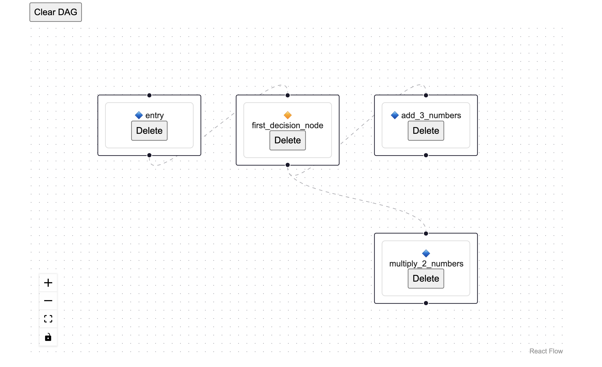
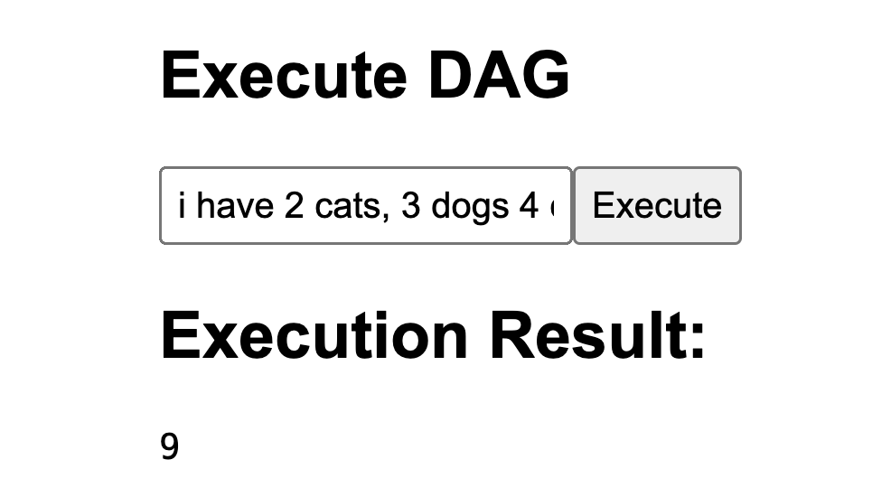

# Architect DAGent

  

A backend and UI to make a low/no-code workflow builder for creating and managing Directed Acyclic Graphs (DAGs). This project allows users to:

1. Create function nodes and decision nodes
2. Connect nodes to form complex workflows
3. Visualize the DAG structure in real-time
4. Execute the workflow and view results

Architect DAGent is designed to simplify the process of building and managing complex workflows, making it accessible to both developers.

